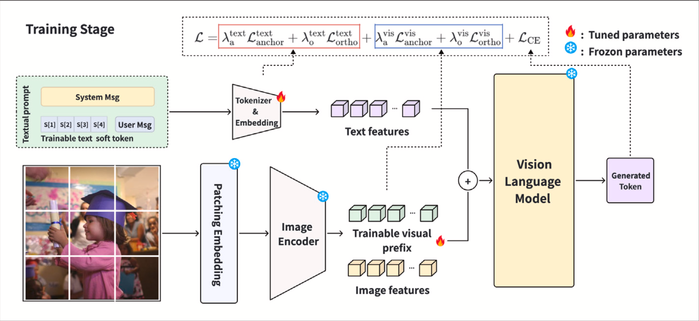
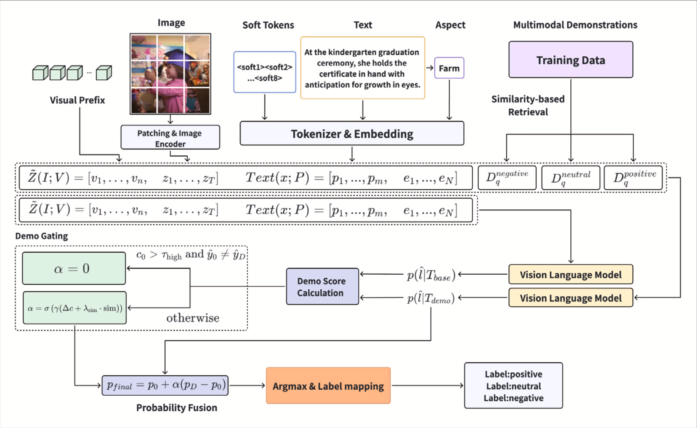

# PTCD: Prompt Tuning and Contrastive Decoding for Multimodal Sentiment Analysis

Official implementation of the Pattern Recognition paper:

**Enhancing VLM-based Multimodal Sentiment Analysis via Prompt Tuning and Contrastive Decoding**

[Paper](https://doi.org/10.1016/j.patcog.2026.114624) | [Citation](CITATION.cff) | [License](LICENSE)

PTCD is a parameter-efficient framework for few-shot multimodal sentiment analysis. It combines multimodal prompt tuning with retrieval-augmented contrastive decoding: during training, only lightweight textual soft prompts and visual prefix prompts are optimized while the VLM backbone remains frozen; during inference, an adaptive demo-gating mechanism selectively uses informative retrieved demonstrations and suppresses misleading ones.

## Highlights

- **Parameter-efficient multimodal adaptation**: freezes Qwen2.5-VL and trains only textual soft prompts and visual prefix prompts.
- **Textual + visual prompt tuning**: uses 8 textual soft tokens and 16 visual prefix tokens in the paper setting.
- **Retrieval-augmented contrastive decoding**: compares a base branch and a demonstration-augmented branch at inference time.
- **Adaptive demo gating**: fuses label distributions with confidence gain and distributional consistency.
- **Few-shot MSA evaluation**: reports main results on MVSA-S, MVSA-M, Twitter-2015, and Twitter-2017.

## Method

PTCD has two stages.

**1. Multimodal Prompt Tuning**

The VLM backbone is frozen. PTCD adds trainable textual soft tokens to the tokenizer/embedding space and visual prefix tokens to the vision stream. Only these prompt parameters are updated, requiring less than 1% of the full model parameters.

<p align="center">
  
</p>

<p align="center"><em>Training stage: textual soft tokens and visual prefix tokens are optimized while the VLM backbone remains frozen.</em></p>

**2. Retrieval-Augmented Contrastive Decoding**

At inference time, PTCD builds two branches for each query:

- `base`: prompt-tuned prediction without retrieved demonstrations.
- `demo`: prompt-tuned prediction with retrieved in-context demonstrations.

<p align="center">
  
</p>

<p align="center"><em>Inference stage: PTCD retrieves multimodal demonstrations, compares base and demo branches, and adaptively fuses their label distributions.</em></p>

The final label distribution is fused as:

```text
p_final = (1 - alpha) * p0 + alpha * pD
```

where `alpha` is controlled by confidence gain and distributional consistency. If the base branch is confident but the demo branch predicts a conflicting label, PTCD suppresses the demo influence.

The released defaults match the paper:

```text
tau_high = 0.3
gamma = 7.5
lambda_sim = 0.05
```

## Results

Main paper results on the 1% few-shot setting:

| Dataset | Accuracy | Macro-F1 | Weighted-F1 |
| --- | ---: | ---: | ---: |
| MVSA-S | **72.06** | **61.10** | **71.57** |
| MVSA-M | **68.56** | **53.05** | **66.16** |
| Twitter-2015 | **65.96** | **62.64** | **66.35** |
| Twitter-2017 | **60.78** | **61.27** | **60.72** |

Please refer to the paper for complete baseline comparisons and ablation studies.

## Installation

Create an environment and install the core dependencies:

```bash
conda create -n ptcd python=3.10 -y
conda activate ptcd
pip install -r requirements.txt
```

Optional analysis and augmentation tools:

```bash
pip install -r requirements-extra.txt
```

By default, scripts use the Hugging Face model id:

```text
Qwen/Qwen2.5-VL-7B-Instruct
```

You can use a local checkpoint instead:

```bash
export MODEL_NAME=/path/to/Qwen2.5-VL-7B-Instruct
```

## Data Preparation

This repository contains TSV split files used by the code. Dataset images are not redistributed. Please download the images from the official dataset sources and organize them as:

```text
datasets/
├── mvsa-s/
│   ├── train_few1.tsv
│   ├── dev_few1.tsv
│   ├── test.tsv
│   └── imgs/
│       └── *.jpg
├── mvsa-m/
│   └── ...
├── t2015/
│   └── ...
└── t2017/
    └── ...
```

To build JSONL files, sentence embeddings, and offline retrieval indices:

```bash
cd datasets
bash run_data.sh
```

The default command processes the four paper datasets: `mvsa-s`, `mvsa-m`, `t2015`, and `t2017`.

Useful overrides:

```bash
DATASETS="mvsa-s" bash run_data.sh
SBERT_MODEL=sentence-transformers/sbert-roberta-large bash generate.sh
DEMO_EMB_TAG=sbert-roberta-large MODE=test bash topk.sh
```

Generated retrieval files are intentionally ignored by git:

```text
train_sbert-roberta-large.npy
test2train_sbert-roberta-large_top10_idx.npy
test2train_sbert-roberta-large_perclass_top5.npz
```

## Quick Start

Train the PTCD prompts for one dataset:

```bash
CUDA_VISIBLE_DEVICES=0 bash scripts/train_ptcd.sh mvsa-s
```

Evaluate the full PTCD method:

```bash
CUDA_VISIBLE_DEVICES=0 bash scripts/eval_ptcd.sh mvsa-s
```

The evaluation script enables the paper method by default:

```text
USE_DEMO=1
DEMO_CONTRASTIVE=1
DEMO_MODE=perclass
DEMO_TOPK=1
```

For a prompt-only ablation:

```bash
CUDA_VISIBLE_DEVICES=0 bash scripts/eval_prompt_only.sh mvsa-s
```

## Reproducing Paper Results

Prepare data and retrieval indices:

```bash
cd datasets
DATASETS="mvsa-s mvsa-m t2015 t2017" bash run_data.sh
cd ..
```

Train prompts:

```bash
for dataset in mvsa-s mvsa-m t2015 t2017; do
  CUDA_VISIBLE_DEVICES=0 bash scripts/train_ptcd.sh "$dataset"
done
```

Evaluate PTCD:

```bash
for dataset in mvsa-s mvsa-m t2015 t2017; do
  CUDA_VISIBLE_DEVICES=0 bash scripts/eval_ptcd.sh "$dataset"
done
```

Outputs are written to:

```text
outputs/checkpoints/<dataset>/
logs/<dataset>/predictions.jsonl
logs/<dataset>/metrics.json
logs/<dataset>/*_cd_debug.jsonl
```

## Configuration

Paper reproduction configs are under:

```text
configs/paper/
├── mvsa-s.json
├── mvsa-m.json
├── t2015.json
└── t2017.json
```

These configs keep the paper defaults explicit:

| Setting | Value |
| --- | --- |
| Backbone | Qwen2.5-VL-7B |
| Textual soft tokens | 8 |
| Visual prefix tokens | 16 |
| Training steps | 1500 |
| Batch size | 4 |
| Warmup | 200 steps |
| Precision | BF16 |
| Visual prompt LR | 0.3 x textual prompt LR |
| Gradient checkpointing | Disabled by default |
| Demo gating | Probability-level fusion |

Common environment variables:

| Variable | Default | Description |
| --- | --- | --- |
| `MODEL_NAME` | `Qwen/Qwen2.5-VL-7B-Instruct` | VLM backbone id or local path |
| `DATA_ROOT` | `<repo>/datasets` | Dataset root |
| `OUTPUT_DIR` | `<repo>/outputs` | Prompt checkpoints and training logs |
| `SOFT_PROMPT_CKPT` | auto-detected | Prompt checkpoint for evaluation |
| `SBERT_MODEL` | `sentence-transformers/sbert-roberta-large` | Sentence encoder for retrieval |
| `DEMO_EMB_TAG` | `sbert-roberta-large` | Retrieval embedding filename tag |
| `USE_DEMO` | `1` in `eval_ptcd.sh` | Enable retrieved demonstrations |
| `DEMO_CONTRASTIVE` | `1` in `eval_ptcd.sh` | Enable contrastive demo gating |

## Repository Structure

```text
PTCD/
├── configs/
│   ├── paper/                    # paper reproduction configs
│   └── *.json                    # compatibility and additional dataset configs
├── datasets/
│   ├── data_tsv2json.py
│   ├── generate_emb.py
│   ├── precompute_topk.py
│   ├── run_data.sh
│   └── <dataset>/*.tsv
├── logs/
│   ├── logs.py
│   └── analyze_logs.py
├── scripts/
│   ├── train_ptcd.sh             # prompt tuning
│   ├── train_ptcd_batch.sh       # batch prompt tuning
│   ├── eval_ptcd.sh              # full PTCD evaluation
│   ├── eval_prompt_only.sh        # ablation
│   ├── eval_prompt_variants.sh    # prompt variant ablations
│   └── eval_prompt_ensemble.sh    # prompt ensemble ablations
├── src/
│   ├── cli/
│   │   └── run.py                # inference and evaluation entry point
│   ├── common/                   # args, metrics helpers, shared utilities
│   ├── data/                     # datasets, label spaces, retrieval demos
│   ├── inference/                # generation and contrastive decoding
│   ├── prompting/                # instruction templates
│   └── prompt_tuning/
│       ├── train_soft_prompt.py
│       ├── prompt_learner.py
│       └── sp_utils.py
├── requirements.txt
├── requirements-extra.txt
├── CITATION.cff
└── LICENSE
```

## Additional Dataset Support

The codebase also contains experimental support for MASAD and TumEmo. These datasets are kept for research convenience but are not part of the main paper evaluation.

## Citation

```bibtex
@article{wang2026ptcd,
  title = {Enhancing VLM-based multimodal sentiment analysis via prompt tuning and contrastive decoding},
  author = {Wang, Xiaowan and Liu, Yiming and Chen, Yifeng and Zhang, Jianxin and Lu, Xiusheng},
  journal = {Pattern Recognition},
  volume = {180},
  pages = {114624},
  year = {2026},
  doi = {10.1016/j.patcog.2026.114624}
}
```

## Acknowledgements

This project builds on Qwen2.5-VL and sentence-transformer retrieval models. We thank the creators of MVSA-S, MVSA-M, Twitter-2015, and Twitter-2017 for providing the benchmark datasets used in the paper.

## License

This repository is released under the Apache License 2.0. Dataset files and images remain subject to their original licenses and terms of use.
